# 🐍 Python Learning Repository


---

## 📌 Overview

This repository documents my **Python learning journey**, covering:

* 🧠 **Core Python fundamentals** (learned primarily from *Apna College*)
* 📊 **Popular Python libraries** for data analysis and visualization
* 📓 **Extensive Jupyter notebooks** used as structured notes + hands-on practice
* 🛠️ **Mini projects** for applying concepts in real-world scenarios

---

The goal of this repo is to act as:

* A **personal reference** for revision
* A **practice playground** for concepts
* A **showcase of consistency** through my *#100DaysOfCode* journey

---

## 🎯 Goals of This Repository

* Build a **strong foundation** in Python
* Develop **problem-solving skills**
* Learn **data analysis & visualization** libraries deeply
* Maintain **structured notes** for revision
* Track progress through **#100DaysOfCode**
* Create a reusable **learning reference**

---

## 🔗 Related Repository: AI / ML & Data Science

I am also actively learning **AI, Machine Learning, and Data Science** from *Apna College*. All advanced AI/ML concepts, notebooks, and practice related to that journey are maintained separately here:

👉 **AI / ML & Data Science Repository**
🔗 [https://github.com/TonyStark-19/AI-ML-DataScience](https://github.com/TonyStark-19/AI-ML-DataScience)

> This Python repository focuses on **foundations + data handling + visualization**, while the linked repo dives deeper into **AI/ML models, math, and applied data science workflows**.

---

## 📊 Repository Statistics

| Category                   | Count                 |
| -------------------------- | --------------------- |
| 🧾 Total Python Programs   | **100**               |
| 📓 Total Jupyter Notebooks | **28**                |
| 📁 Mini Projects           | **3**                 |
| 📦 Core Python Topics      | **11+**               |
| 📈 Libraries Covered       | **4 major libraries** |

---

## 🔹 Core Python Concepts

| Topic                      | Contents                                                       |
| -------------------------- | -------------------------------------------------------------- |
| **Basic Questions**        | 13 beginner-level Python programs                              |
| **Conditional Statements** | 9 programs (if-else, nested conditions, logical operators)     |
| **Loops**                  | 8 programs (for, while, loop-based problems)                   |
| **Strings**                | 6 programs + 1 notebook (string methods & manipulation notes)  |
| **Lists**                  | 7 programs + 1 notebook (lists, methods & comprehensions)      |
| **Tuples**                 | 3 programs + 1 notebook (tuple properties & use-cases)         |
| **Sets**                   | 4 programs + 1 notebook (set operations & applications)        |
| **Dictionaries**           | 4 programs + 1 notebook (dictionary operations & methods)      |
| **Functions & Recursion**  | 14 programs (functions, parameters, recursion problems)        |
| **File I/O**               | 7 programs (reading/writing files & handling file types)       |
| **OOPS**                   | 17 programs + 1 notebook (classes, objects, inheritance, etc.) |

---

## ⚙️ Practical Python Concepts

### 📦 Exception Handling

* Covers common runtime errors
* Proper use of `try`, `except`, `else`, and `finally`
* **2 dedicated topics** with examples

---

### 🗂️ Working with JSON

* 3 Python programs
* 3 JSON files for practice
* Parsing, reading, writing, and manipulating JSON data

---

## 🔹 Data Handling & Thinking in Data

This section focuses on understanding and working with data **before using heavy libraries**.

* 📡 **Data Collection using APIs** – 1 notebook (notes + examples)
* 🌐 **Web Scraping** – 1 notebook (concepts & notes) + 1 practice notebook
* 🧠 **Thinking in Data (Plain Python)** – 1 notebook focused on data understanding using core Python

---

## 🔹 Python Libraries

### 🔢 NumPy

* 1 notebook → NumPy notes & fundamentals
* 4 notebooks → Level-wise NumPy concepts (Level 1 to 4)
* NumPy-100 Exercises:

  * Level 1 – 1 notebook
  * Level 2 – 1 notebook

---

### 🐼 Pandas

* 1 notebook → Pandas notes
* 1 notebook → Series deep dive
* 1 notebook → DataFrame deep dive

---

### 📈 Matplotlib

* 1 notebook → Matplotlib notes
* 3 notebooks →

  * Univariate Analysis
  * Bivariate Analysis
  * Multivariate Analysis
* 1 notebook → Object-Oriented (OO) API

---

### 🎨 Seaborn

* 1 notebook → Seaborn notes
* 2 notebooks → Deep dive into Seaborn plots & visualizations

---

## 🔹 Projects

* **Mini Python Projects**

  * 3 small projects focused on applying Python concepts practically

---

## 📸 Visualizations Preview

Some examples of work in this repo:

> ### Matplotlib plots:

| Line Chart  | Box Plot |
|------------|------------|
| 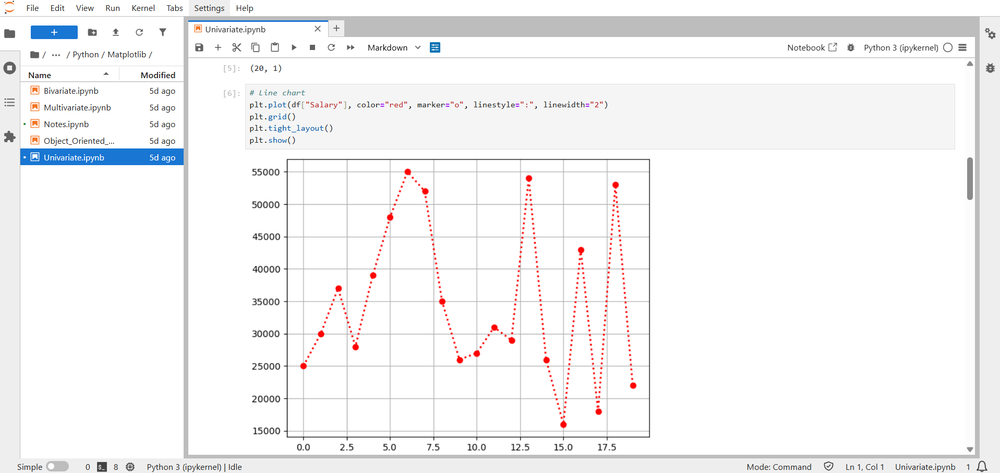 | 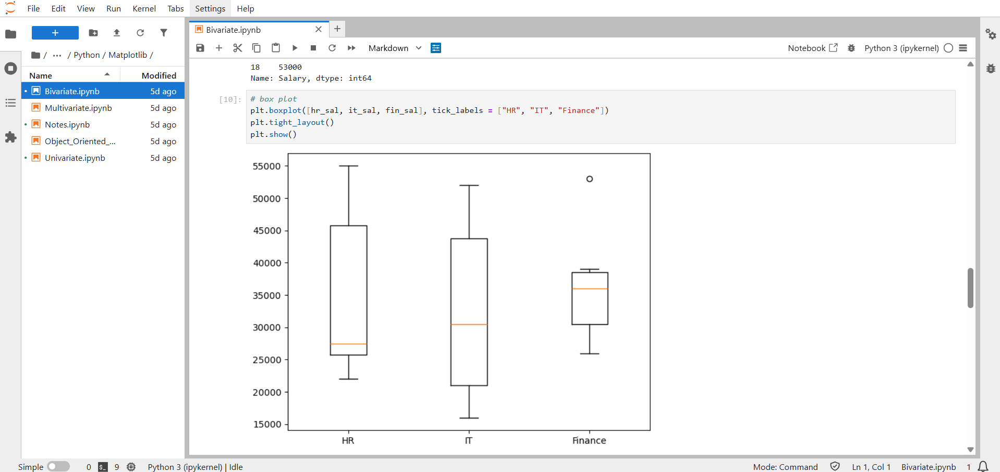 |

| Bar Plot | Bubble Plot |
|------------|------------|
| 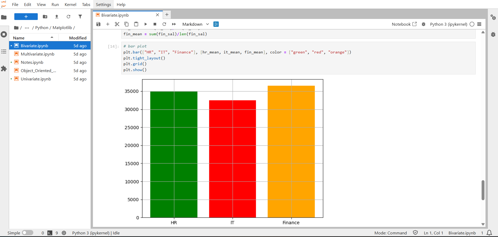 | 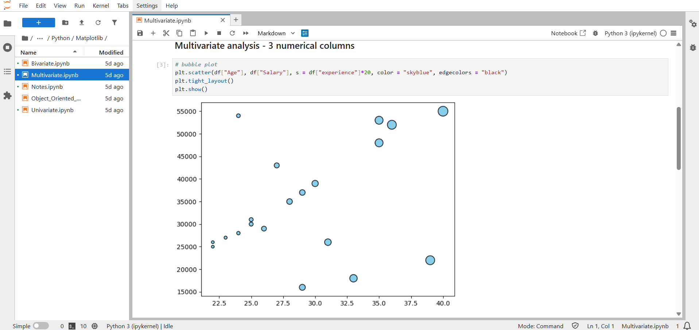 |

| Multiple Datasets Line Chart | 3D Plot |
|------------|------------|
| 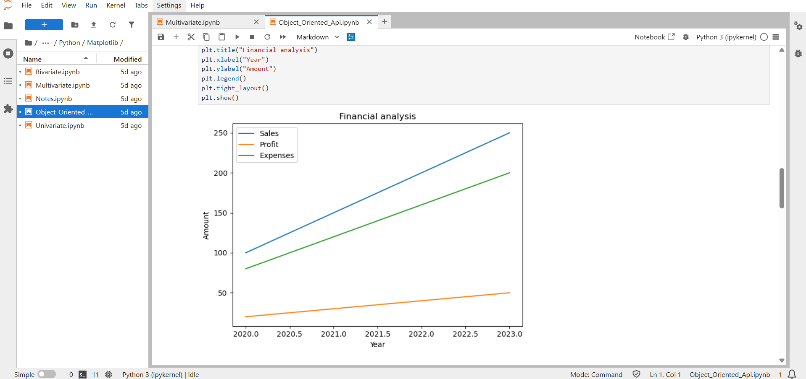 | 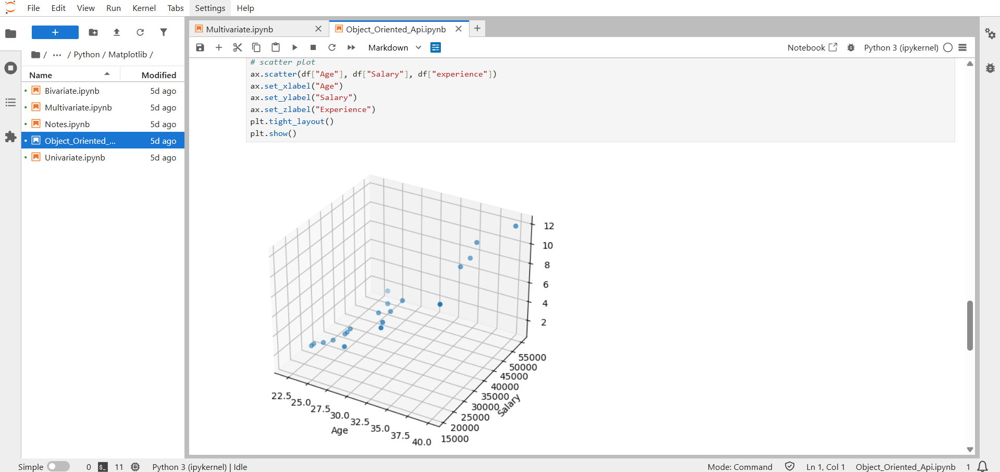 |

---

> ### Seaborn plots:

| Scatter Plot  | Sworm Plot |
|------------|------------|
| 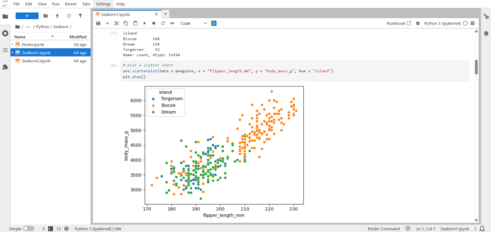 | 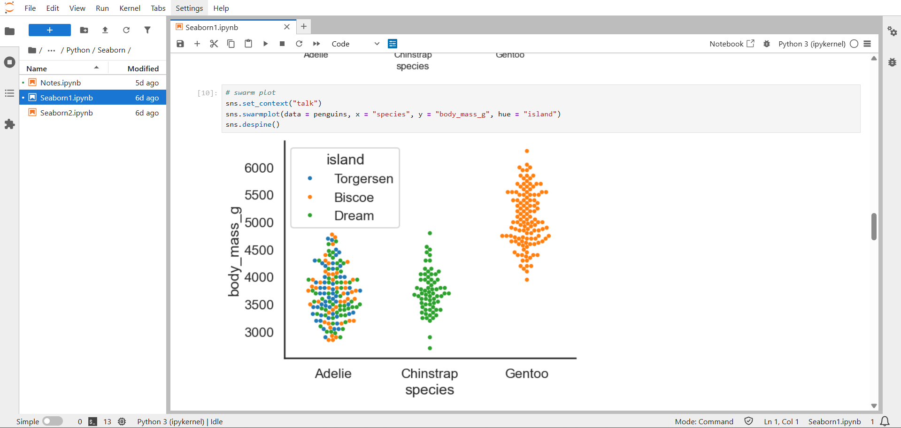 |

| Line Plot | Violin Plot |
|------------|------------|
| 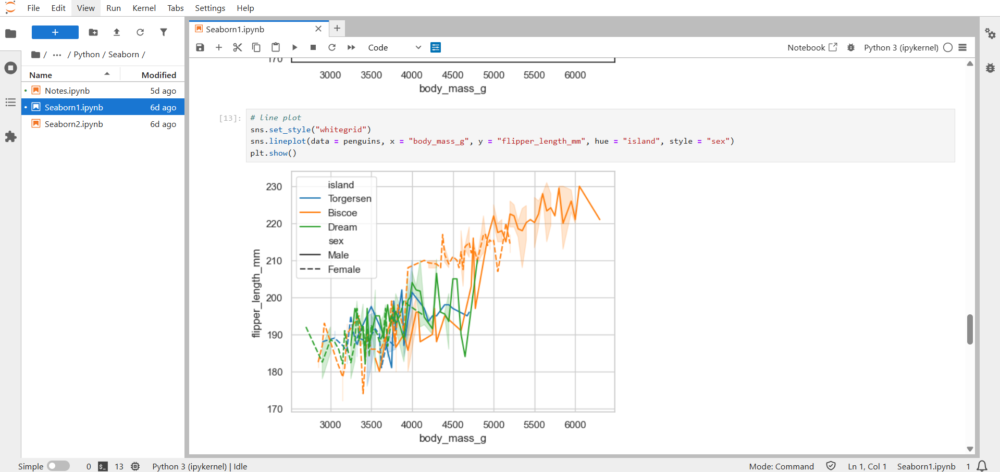 | 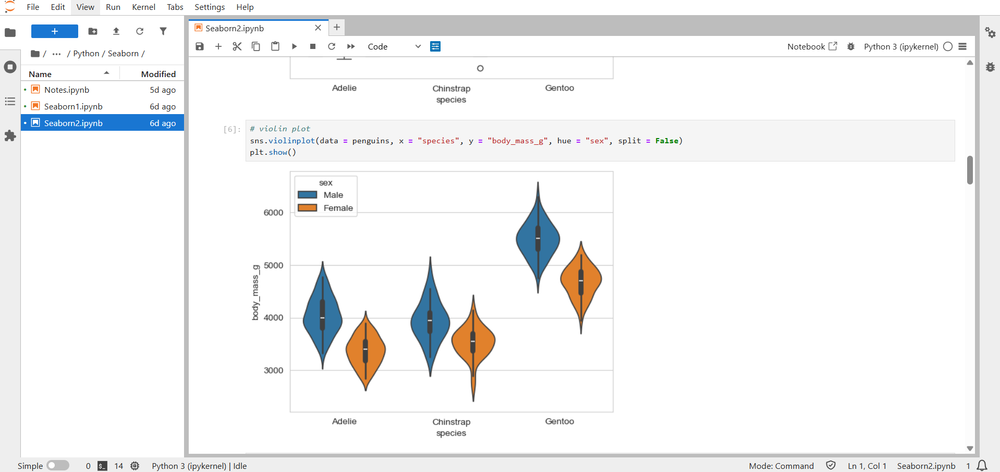 |

| Heat Map | Pair Grid |
|------------|------------|
| 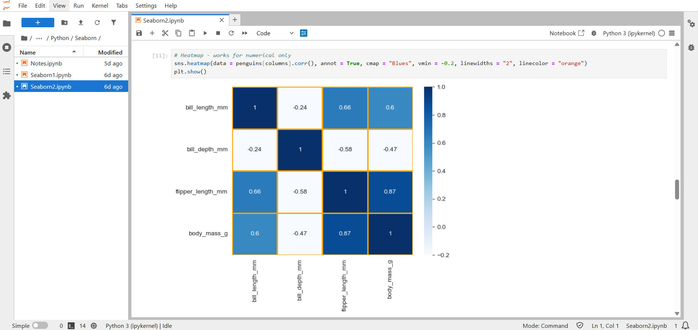 | 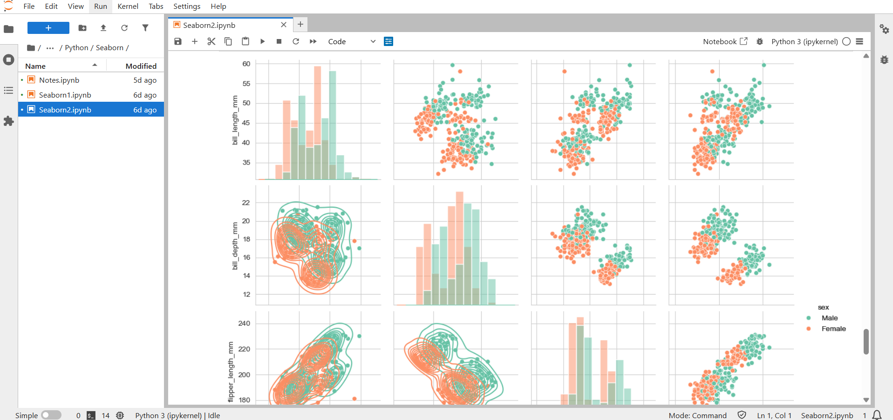 |

---

## 🚀 Technologies Used

* **Python 3.x**
* **Jupyter Notebook**
* Libraries:

  * `numpy`
  * `pandas`
  * `matplotlib`
  * `seaborn`

---

## 🔧 Requirements

Install required libraries with:
```bash
pip install -r requirements.txt
```
---

## 📘 How to Use

1. Clone the repository:
   ```bash
   https://github.com/TonyStark-19/Python-coding.git
   ```

2. Navigate into the repository:
   ```bash
   cd Python-coding
   ```
   
3. Open Jupyter Notebook to explore:
   ```bash
   jupyter notebook
   ```
---

## 📚 Resources

- [Python Tutorial by Apna College](https://youtu.be/ERCMXc8x7mc?si=EbKkLQxwQgK_4Ui0)
- [Numpy Tutorial by Chai or Code](https://youtu.be/x7ULDYs4X84?si=pXXvslaNMdeCSmI-)
- [Pandas Tutorial by Intellipaat](https://youtu.be/vtgDGrUiUKk?si=lIwxfpB40OW8H8rA)
- [MatplotLib Tutorial by Intellipaat](https://youtu.be/xXibS9832FM?si=wiYYnAuzHqK3QCy8)
- [Seaborn Tutorial by Intellipaat](https://youtu.be/39cge_JhVjI?si=ZgZH86euanXXslTN)

---

## 🤝 Contributions

This repository is mainly for **personal learning and documentation**, but:

* Suggestions
* Improvements
* Pull Requests

are always welcome 🙂

---

## ⭐ Acknowledgements

* **Apna College** for structured Python fundamentals
* **Open-source community & documentation**
* Everyone sharing knowledge through blogs, videos & tutorials

---

✨ *If you find this repo useful, consider giving it a star!* ⭐
